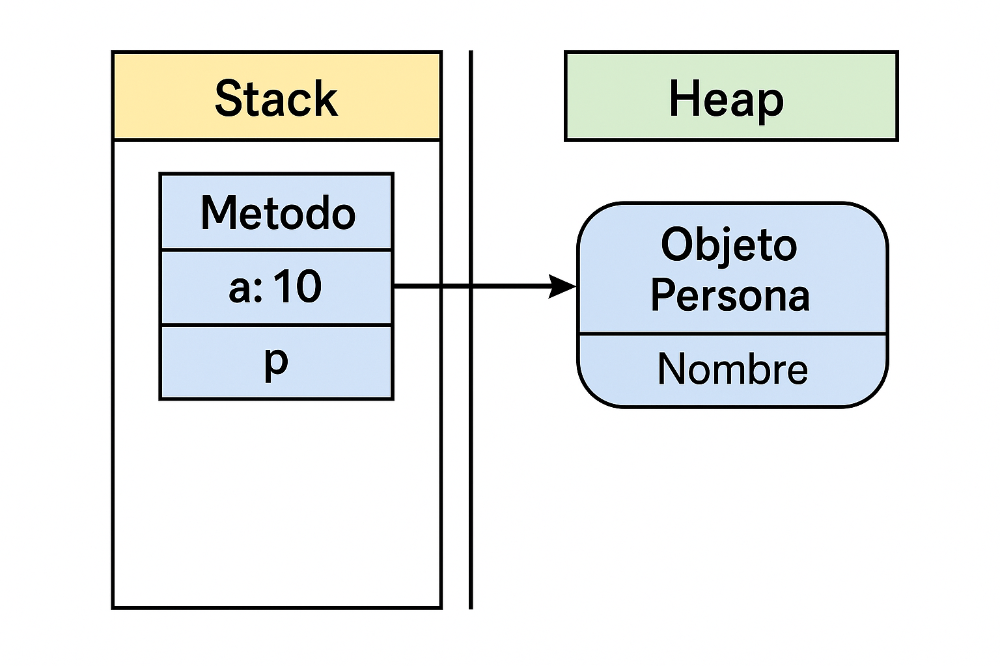

# 🧠 Value Types vs Reference Types (Stack vs Heap)

## 🔍 What is the Stack?

The **Stack** is a memory region used to:
- Store local variables and value types.
- Manage method calls.
- Organize memory using a **LIFO** (Last-In, First-Out) structure.

### Characteristics:
- Very fast memory access.
- Short lifespan: automatically released when the method ends.
- No garbage collection required.

## 📦 What is the Heap?

The **Heap** is a memory region:
- Used to store reference type objects.
- Managed by the **Garbage Collector**.
- Objects can persist in memory while references exist.

### Characteristics:
- Slower than stack.
- Longer lifespan.
- Requires garbage collection.

## 🧬 Visual diagram

The following image shows how memory is organized when a method executes:



In this example:
- `a = 10` is stored in the **Stack** as a value type.
- `p` is a reference on the **Stack** pointing to a `Persona` object on the **Heap**.
- The `Nombre` field is inside the Heap.

## 📌 Value Types

- Store data directly.
- Allocated on the **Stack**.
- Copied when assigned or passed to methods.
- **Examples**: `int`, `double`, `bool`, `char`, `struct`, `enum`.

```csharp
int a = 5;
int b = a;
b = 10;
Console.WriteLine(a); // Prints 5
```

## 📌 Reference Types

- Store a reference to the actual data.
- The object lives in the Heap, the reference in the Stack.
- Shared when assigned or passed.
**Examples**: `class`, `string`, `array`, `object`, `List<T>`, `Dictionary<TKey, TValue>`, `delegate`.

```csharp
class Persona { public string Name; }

Persona p1 = new Persona { Name = "Ana" };
Persona p2 = p1;
p2.Name = "Luis";
Console.WriteLine(p1.Name); // Prints "Luis"
```

## 🧠 Summary comparison

| Aspect            | Stack                          | Heap                            |
|-------------------|--------------------------------|----------------------------------|
| Usage             | Local variables, value types   | Objects created with `new`       |
| Memory management | Automatic (method end)         | Garbage Collector (GC)           |
| Speed             | Faster                         | Slower                           |
| Size              | Limited                        | Larger                           |
| Examples          | `int`, `bool`, `double`, `struct`, `char`, `enum` | `class`, `string`, `array`, `object`, `List<T>`, `Dictionary<TKey, TValue>`, `delegate` |

---

# 🧠 Tipos por valor vs Tipos por referencia (Stack vs Heap)

## 🔍 ¿Qué es el Stack?

El **Stack** (pila) es una región de memoria usada para:
- Almacenar variables locales y tipos por valor.
- Gestionar llamadas a métodos.
- Organizar la memoria como una **pila LIFO** (*último en entrar, primero en salir*).

### Características:
- Acceso muy rápido.
- Vida corta: se libera automáticamente al salir del método.
- No requiere Garbage Collector.

## 📦 ¿Qué es el Heap?

El **Heap** (montón) es una región de memoria:
- Usada para almacenar objetos de tipos por referencia.
- Su memoria es manejada por el **Garbage Collector**.
- Los objetos viven mientras existan referencias hacia ellos.

### Características:
- Más lento que el Stack.
- Vida útil más prolongada.
- Requiere recolección de basura.

## 🧬 Diagrama explicativo

La siguiente imagen muestra cómo se organiza la memoria al ejecutar un método:


En este ejemplo:
- `a = 10` se guarda en el **Stack** como tipo por valor.
- `p` es una referencia en el **Stack** que apunta a un objeto `Persona` en el **Heap**.
- El campo `Nombre` vive en el Heap.

## 📌 Tipos por valor

- Contienen directamente sus datos.
- Se almacenan en el **Stack**.
- Se copian al asignarse o pasarse a métodos.
- **Ejemplos**: `int`, `double`, `bool`, `char`, `struct`, `enum`.

```csharp
int a = 5;
int b = a;
b = 10;
Console.WriteLine(a); // Imprime 5
```

## 📌 Tipos por referencia

- Almacenan una referencia a los datos reales.
- El objeto vive en el Heap, la referencia en el Stack.
- Se comparte la referencia al asignarse o pasarse.
**Examples**: `class`, `string`, `array`, `object`, `List<T>`, `Dictionary<TKey, TValue>`, `delegate`.

```csharp
class Persona { public string Nombre; }

Persona p1 = new Persona { Nombre = "Ana" };
Persona p2 = p1;
p2.Nombre = "Luis";
Console.WriteLine(p1.Nombre); // Imprime "Luis"
```
## 🧠 Comparación resumida

| Aspecto           | Stack                          | Heap                            |
|-------------------|--------------------------------|----------------------------------|
| Tipo de uso       | Variables locales, tipos por valor | Objetos creados con `new`        |
| Gestión de memoria| Automática (al salir del método) | Garbage Collector (GC)           |
| Velocidad         | Más rápida                     | Más lenta                        |
| Tamaño            | Limitado                       | Más grande                       |
| Ejemplos          | `int`, `bool`, `double`, `struct`, `char`, `enum` | `class`, `string`, `array`, `object`, `List<T>`, `Dictionary<TKey, TValue>`, `delegate` |
